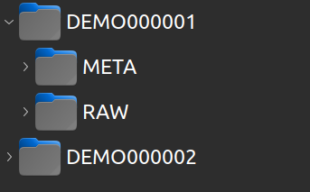
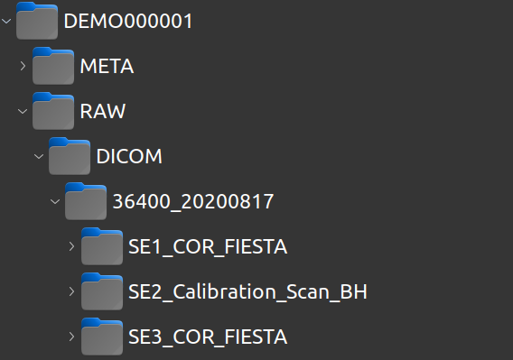
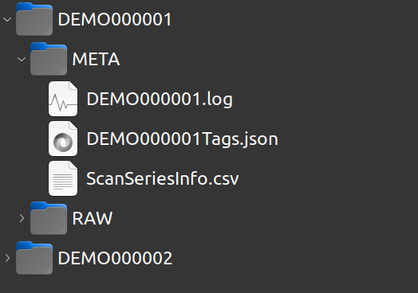

.. _concept:

Concept
=======

The purpose of hurahura is a medical imaging data management service. 

The storage system is intentionally kept simple. No database is employed. 

From a root directory a new subdirectory is built per “examination” as a new “subject”. 

Each subject is named with a simple format of PREFIXNUMBER

E.g. if the prefix is BRAIN then subjects will be named 

**BRAIN000001**, **BRAIN000002**, **BRAIN000003** etc

The root-directory, prefix and zero padding may be customized (as well as other attributes). . 

Each subject then has a standard sub-directory structure of META, RAW/DICOM and optionally RAW/OTHER

- **RAW/DICOM** is to hold raw dicom data. 
- **META** holds meta data, especially a log file, a json file containing tags extracted from the dicom data for quick and easy interrogation and a summary.csv file which provides a user friendly interface to query dicom data attributes. 
- **RAW/OTHER** is built on demand if OTHER raw data is to be loaded. However, in such circumstances it is likely more preferable to build a subclass of the AbstractSubject class that hurahura provides and employ their own customization. See ?? for further details. 

As example basic directory structure is shown below two subjects. In this case the subjectPrefix is "DEMO" :

----

The organised DICOMs for subject #1 is as follows:

----

And the files in the META directory are:

----

Customisation beyond this setup is possible via subclassing the AbstractSubject class. 

See: :ref:`usage` for further details. 