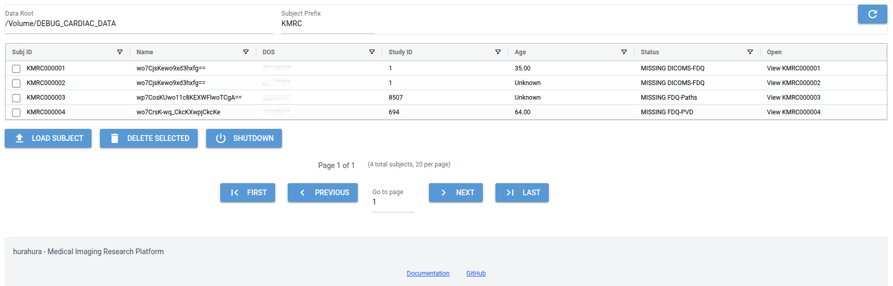
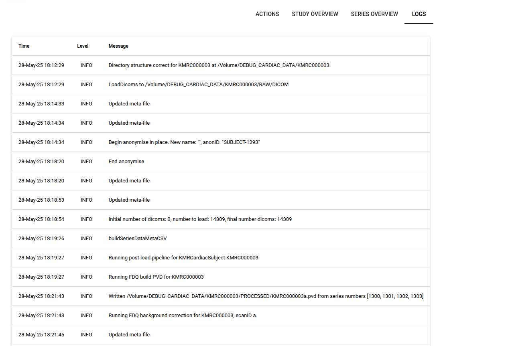
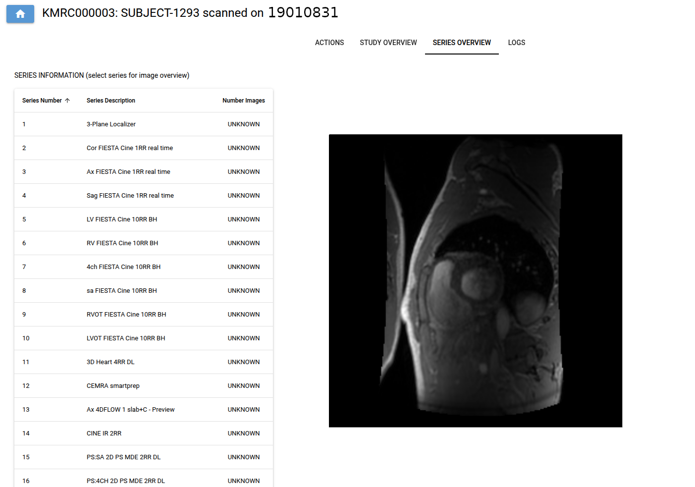
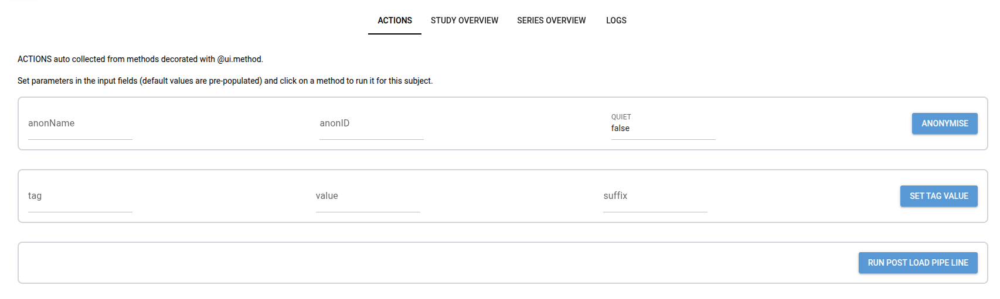

.. _web_interface:

Web Interface
===============

A basic web interface to hurahura project data is available, built upon `nicegui <https://nicegui.io/>`_. 

To run the UI run the following command:

.. code-block:: bash

    hurahura -UI 

Then view at: http://localhost:8080

The port can be changed with the -UI_port option (default is 8080).

As with standard hurahura use parameters are taken from the .conf file passed or configuration settings set (use hurahura -INFO to see what is set). Of course the UI action is also available from a custom setup subclassing the main hurahura class. 

The UI allows for easy management of subjects and data. 

The main page shows a table of all subjects, which can be sorted and filtered. An example is shown below:

The main page provides an overview of subjects with dedicated columns showing ID, Name (may be anonymised), DOS, Age, StudyID, and status. The status can be customised by overloading the SubjClass.getStatus() method. The main page UI supports loading of new subjects and bulk deletions of selected subjects and provides navigation to subject specific pages (via the "View SubjID" button). 

The subject specific pages provide a range of actions and views. 

A view of the subject's logs is provided:

A view of the subject's meta data and series overview (with thumbnails) is provided:

In addition, access to subject specific methods is provided: 

Actions that are displayed are automatically collected from methods decorated with @ui_method decorator. The decorator can be used to add a description, category, and order (position on actions page) to the action. An example is shown below:

.. code-block:: python

    @ui_method(description="Anonymise subject", category="General", order=100)
    def anonymise(self):
        self.anonymise()
        
Note - long running actions should be avoided as the UI will freeze until the action completes. 
